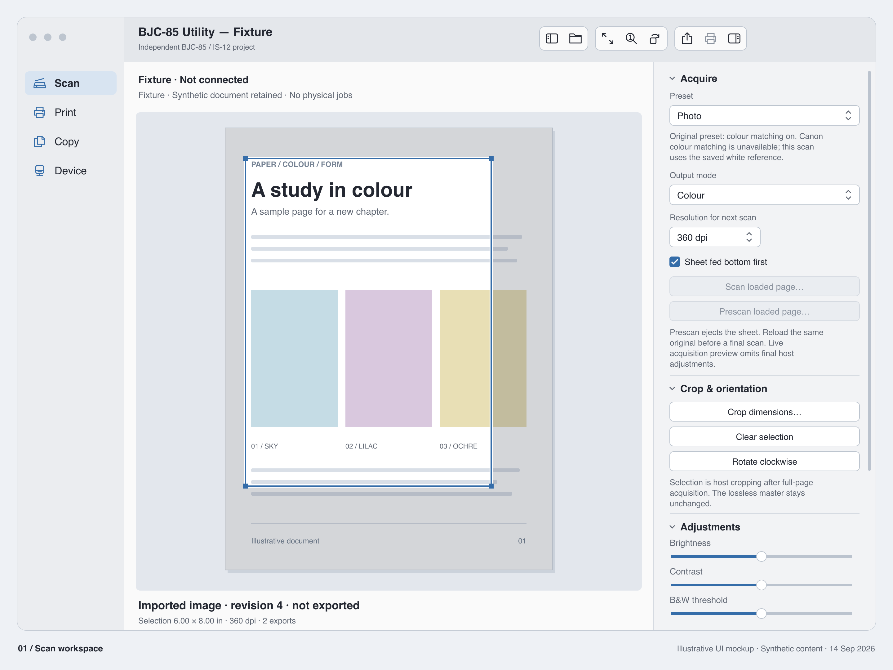
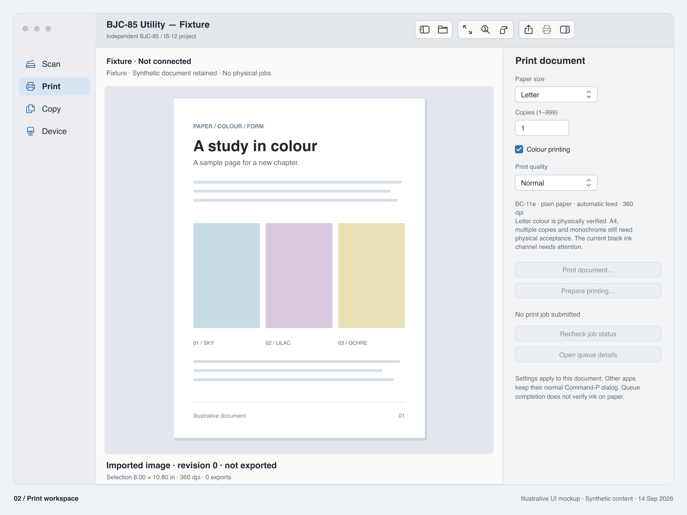
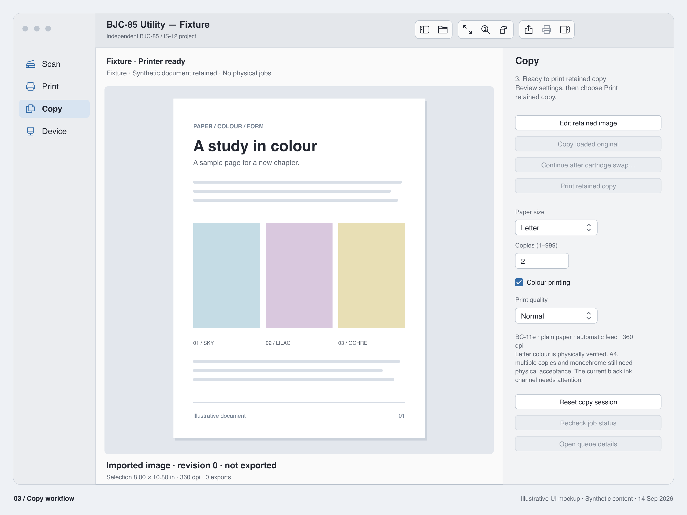
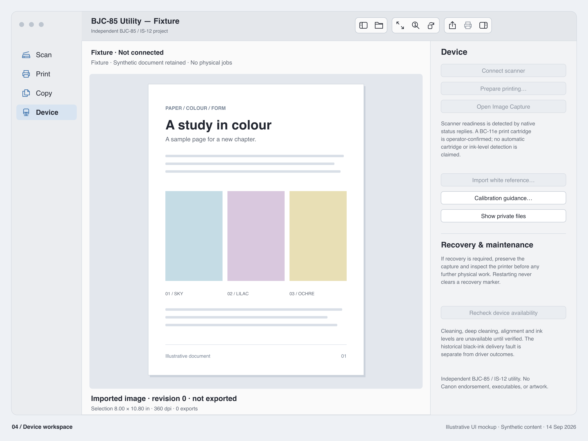
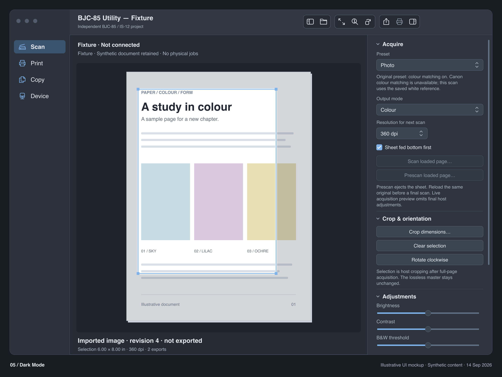
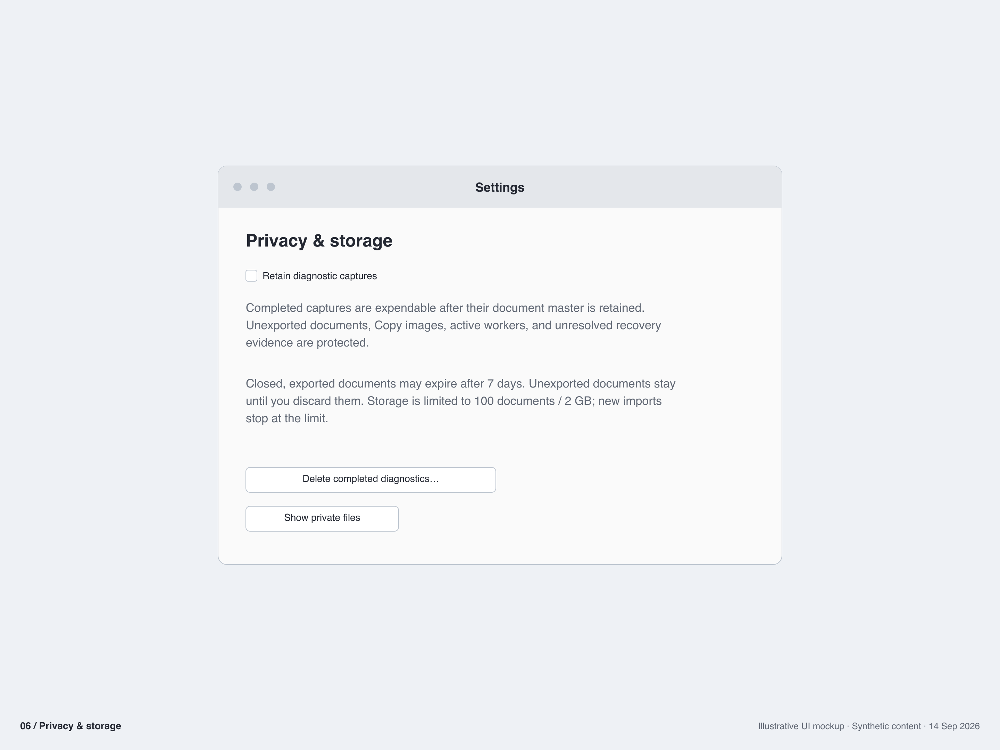

# BJC-85 Utility

**A native macOS home for the Canon BJC-85 and IS-12.**

Print, scan and copy with a classic portable printer on an Apple silicon Mac.
BJC-85 Utility pairs a native AppKit workspace with Gutenprint, PAPPL and a
C/libusb scanner engine. Keep an editable scan, refine its crop and colour,
export it in several formats, or carry it through a guided copy workflow.

**Apple silicon · macOS 14+ deployment target · Swift / AppKit / C**

[User guide](docs/USER-GUIDE.md) · [Build](#build) ·
[Project status](#project-status) · [UI gallery](docs/images/README.md)



*Illustrative UI mockups of the current application, with synthetic documents.
The images use the project's original vector style; they are not hardware-test
screenshots. [Actual fixture captures and verification](docs/macos27-ui-ux-audit.md).*

## What it does

- **Scan and refine.** Photo and document presets, 90/180/360 dpi acquisition,
  colour/grayscale/B&W, prescan, crop, rotation and image adjustments.
- **Keep the original.** A lossless master, editable revisions and export history
  let you export PNG, TIFF and PDF, then return to the same document.
- **Print from your Mac.** Use the utility's document controls or a standard
  macOS print dialog through the local IPP queue.
- **Copy in stages.** Retain a scan, review it, confirm the IS-12-to-BC-11e
  cartridge change, then print or reprint the retained image.
- **Work without a scanner.** Open an image, edit it, export it and restore it
  later. A connected device is needed only for physical operations.
- **Stay native.** Sidebar navigation, a document canvas, a collapsible inspector,
  keyboard crop controls and Dark Mode. No Rosetta or kernel extension.

## Around the app

| Print | Copy |
| --- | --- |
| [](docs/images/02-print-workspace.png) | [](docs/images/03-copy-workflow.png) |
| Paper, copies, colour and quality, with explicit queue status. | Review the retained image and continue through the cartridge change. |

| Device | Dark Mode |
| --- | --- |
| [](docs/images/04-device-workspace.png) | [](docs/images/05-dark-workspace.png) |
| Connection, reference guidance and recovery information. | The same workspace with a dark appearance and an unchanged document. |

<details>
<summary>Privacy & storage</summary>



Diagnostic retention is off by default. Unsaved documents, retained Copy images
and unresolved recovery evidence are protected. See the
[document lifecycle](docs/document-lifecycle.md) for storage and retention rules.

</details>

[View all six images](docs/images/gallery.png) ·
[Editable SVGs and regeneration instructions](docs/images/README.md)

## Project status

**Active development; the current software milestone is not a qualified release.**
The underlying engines have physical print and scan evidence. The latest
document, Copy and UI changes have offline and fixture verification; their full
physical cycle is still pending. Developer ID signing, notarization, supported-OS
runtime acceptance and full VoiceOver qualification also remain open.

Some original Canon features are unavailable, including 200/300 dpi scanning,
proprietary colour matching, cleaning, alignment and ink-level reporting. The
test printer also has a known black-ink delivery problem.

See the [acceptance ledger](docs/release-acceptance.md) and
[physical acceptance plan](docs/physical-acceptance-plan.md) for exact evidence
and remaining work. This is an independent project with no Canon endorsement.

## Build

Build on an Apple silicon Mac with Xcode command-line tools, CMake, pkg-config,
make and Python 3. The first build downloads checksum-pinned dependencies.

```sh
sh scripts/build-release.sh
sh scripts/package-pkg.sh
```

Outputs: `dist/BJC-85 Utility.app` and the unsigned review package. The app and
all bundled libraries target macOS 14 and ARM64. This local build is ad-hoc
signed; Developer ID signing, notarization and clean-machine acceptance are
pending. See [release instructions](docs/RELEASE.md). No installation, service
switching, or device command occurs as part of the build.

[User guide](docs/USER-GUIDE.md) · [Canon UI evidence map](docs/legacy-ui-map.md) ·
[macOS 27 UI/UX audit and real before/after evidence](docs/macos27-ui-ux-audit.md) ·
[Document lifecycle](docs/document-lifecycle.md) ·
[Controller tests](docs/workflow-state-tests.md) ·
[Research provenance](research/manifests/provenance.json)

<details>
<summary>Technical behaviour, limitations and verification history</summary>

## Behaviour and limitations

* Typed readiness separates transport, replies, scanner identity and readiness.
  Wrong heads and warming states fail readiness. Existing references are checked
  for checksum, serial, head class and raw temperature before acquisition.
* Cancellation barriers prevent L/B/W commands after observed cancellation.
  Ambiguous writes never replay. Persistent recovery guards block new native
  operations across app/helper/service restart; process exit alone is not recovery.
* Scan workspace: presets, 90/180/360 dpi, colour/grayscale/thresholded B&W,
  full-page prescan, draggable and keyboard/numeric crop, rotation, zoom,
  deterministic brightness/contrast/sharpen/soften/despeckle/invert, PNG/TIFF/PDF.
* Copy retains the completed image through an explicitly confirmed IS-12 to
  BC-11e swap, with copies/paper/colour/brightness and reprint without rescanning.
  This new complete physical cycle has not yet been exercised.
* Open supported images without a scanner; retain a lossless master, immutable
  acquisition facts, revisioned crop/rotation/adjustments and export history.
  Export PNG then TIFF/PDF, edit or print later, and restore without replaying jobs.
  Full-resolution processing runs on a bounded background worker.
* Specific CUPS job IDs are reconciled through IPP job attributes. Canceled,
  rejected, unknown and completed results remain distinct from safe device reuse.
  Native admission and USB leases protect service transitions and finalization.
* Printing uses the existing localhost IPP queue. Letter/A4, mono/colour,
  360 dpi, copies and mapped draft/normal/high quality are exposed. Media is
  plain paper and feed automatic. Advanced unmapped options stay unavailable.
* 200/300 dpi, Canon Text Enhanced, Canon colour matching/edge processing and
  native cleaning/deep-clean/alignment/ink-level commands are unavailable.
  [Resolution evidence](docs/protocol/is12-200-300dpi.md) records the uncertainty.
* English (Canada) string catalogue, locale-aware crop dimensions, standard
  AppKit controls and labelled keyboard-adjustable crop. Full VoiceOver and
  supported-OS runtime acceptance are still pending.
* Diagnostic retention defaults off. Successful app captures are removed after
  a document master is durably retained; eSCL captures after
  delivery (or 24-hour expiry if undelivered, checked hourly); raw print spool after safe completion. Ambiguous captures remain
  available for recovery. Active/unsaved/Copy documents are protected; closed,
  exported documents may expire after seven days. Import quotas are documented.
  Runtime retention excludes existing research/baseline captures. Repository
  evidence was separately sanitized as described in the [privacy record](docs/REPOSITORY-PRIVACY.md).

## Baseline and verification

Git tag `native-hardware-baseline-2026-09-14` freezes the previous
working source. Its [historical development guide](docs/DEVELOPMENT-BASELINE.md)
retains the original tool and URF-fixture commands.

Baseline physical evidence includes Letter colour printing, content-bearing
90/180 dpi colour scans, blank-sheet 360 dpi colour/grayscale/B&W, calibration,
live preview/cancel and ImageCaptureCore acquisition. Blank-sheet success does
not establish image quality. Black ink delivery remains a hardware problem.

The local review baseline is `software-milestone-2026-09-14`; it was also the clean starting HEAD. New
hardening evidence is under `docs/verification/macos27-hardening/`, including
controller, document, alias/collision, pixel-contract, contention and full-size
worker tests. Use `scripts/test-hardening.sh`, `scripts/test-isolated-services.sh`
and `scripts/benchmark-processing.sh`. Fixture mode is documented in the UI audit
and cannot reach live USB, installed queues or production services.

Earlier offline evidence is under `docs/verification/2026-09-14/`: native C regression
and sanitizer tests, independent scan pixel/live-preview/export comparisons,
Swift settings/state/crop/privacy/accessibility tests, isolated eSCL outcomes and
IPP dry runs, and a relocated bundle dependency audit. See the acceptance ledger
for exact evidence and pending work.

The architecture remains AppKit → service coordination → existing native helper;
Image Capture → localhost eSCL → the same scanner engine; Command-P → CUPS/IPP →
PAPPL → Gutenprint → the same exclusive USB transport. No Rosetta, kernel
extension, proprietary runtime or disabled platform protection is required.

</details>

## Licensing and provenance

No project-wide license has been selected yet. Dependency notices and source
pins are recorded below; a compatible license and distribution materials are
still required before a public release. Original Canon software is research
material only and is excluded from the app bundle.

[Third-party notices and distribution obligations](THIRD_PARTY.md)
